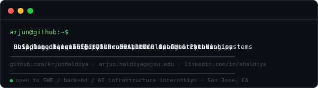

# Hi, I'm Arjun Haldiya

**Software Engineer · Backend Systems · Observability · Agentic AI**

> Building backend systems, observability infrastructure, and agentic pipelines.  
> B.S. Data Science @ SJSU | San Jose, CA

---

---

## Currently building

| Project | Stack | What it does |
|---|---|---|
| **Fleet** | Go, Kafka, Kubernetes, TimescaleDB | Distributed stream processing pipeline with per-stream ordering and horizontal scaling |
| **Trace** | Django, React, WebSockets, PostgreSQL | Real-time vehicle event investigation dashboard with sub-100ms event propagation |
| Exploring | SLO alerting · LLM cost routing · MCP | Observability patterns and agentic infrastructure design |

---

## Tech stack

**Languages**  

**Backend & APIs**  

**Databases & Storage**  

**Infrastructure & Observability**  

**AI & Agentic Systems**  

---

## GitHub stats

---

## Connect

